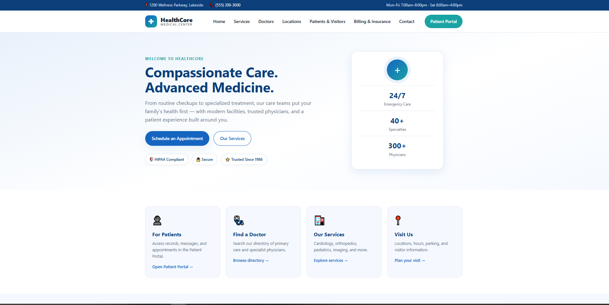
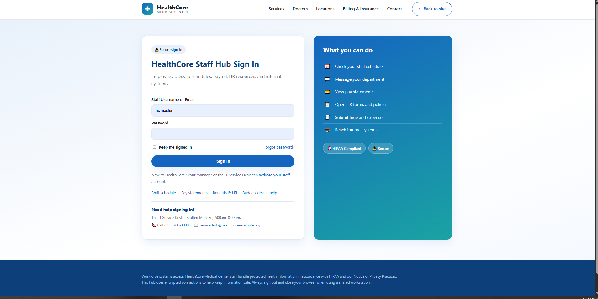
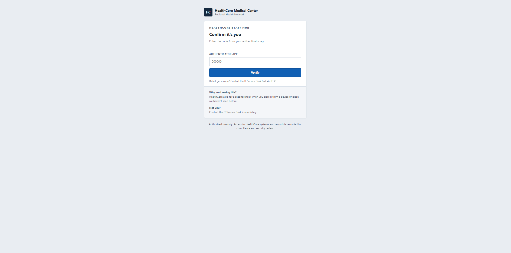
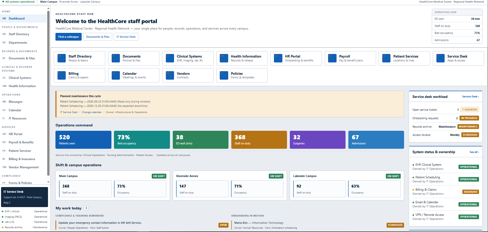
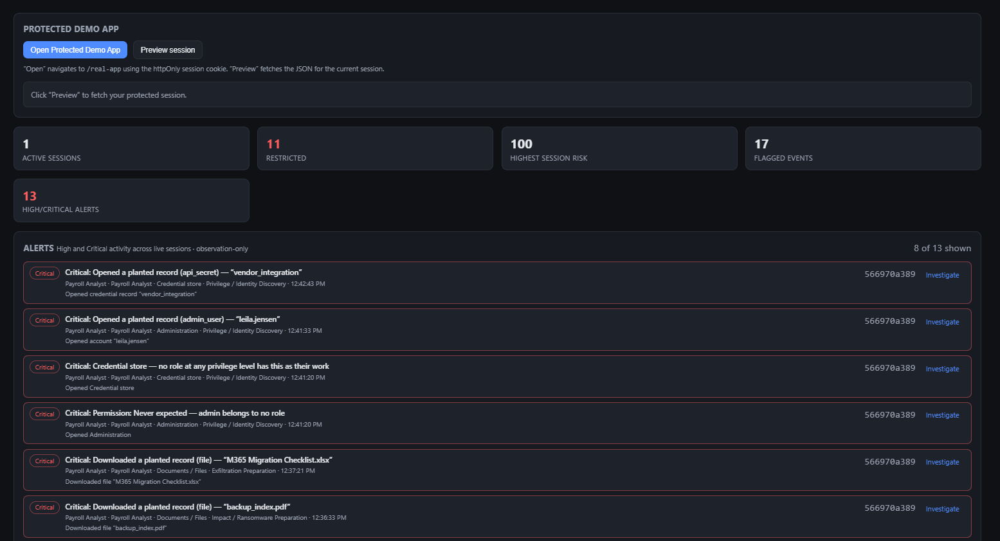
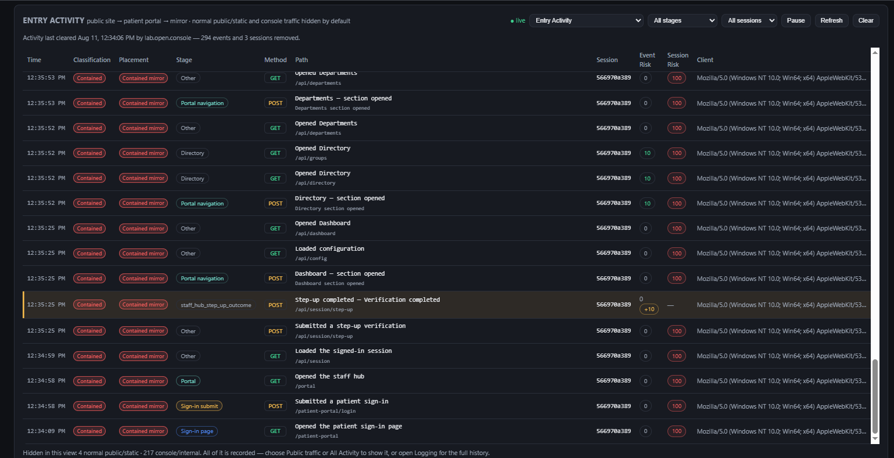
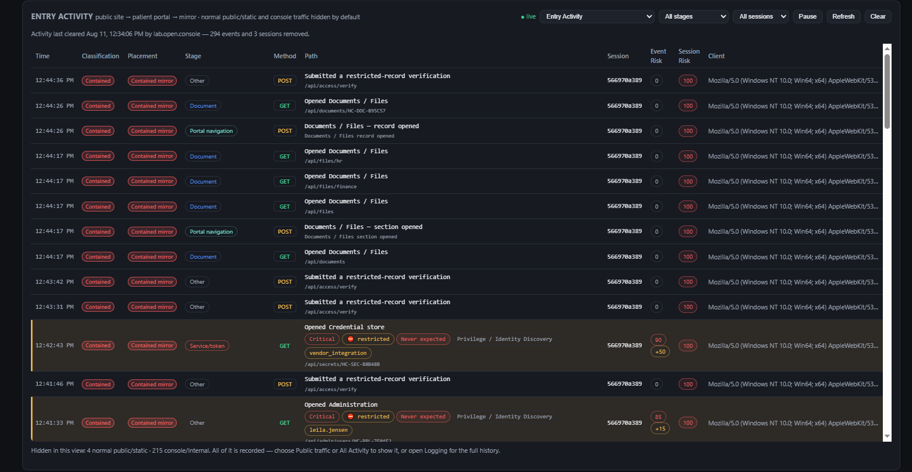

# MirrorSim

MirrorSim is a cybersecurity deception, attack-simulation, monitoring, and defensive command-center platform developed by Envarious.

*All organizations, identities, credentials, records, telemetry, and operational data shown are synthetic and exist solely within the isolated MirrorSim demonstration environment.

## Overview

MirrorSim provides a controlled environment for observing suspicious activity, tracking attacker behavior, and evaluating defensive responses without exposing production systems.

The platform is designed to demonstrate how identity context, permissions, behavioral signals, deception environments, and centralized telemetry can work together during a security incident.

## Core Capabilities

- Deception-based attacker containment
- Suspicious login and session monitoring
- Identity and permission-aware access decisions
- Controlled mirror environments
- Activity and telemetry capture
- Attack-path and session visualization
- Defensive command-center monitoring
- Risk classification and alerting
- MFA and abnormal-access workflow testing
- Investigation timelines and evidence review

## Project Status

The core platform is functional and under active development.

Current work focuses on:

- Expanding the simulated enterprise environment
- Refining command-center reporting
- Improving risk and event classification
- Strengthening identity and permission workflows
- Preparing controlled demonstrations and validation scenarios

## Security and Source Availability

MirrorSim’s production source code, internal routing logic, security controls, detection behavior, and administrative architecture are maintained in private repositories.

This public repository is a sanitized portfolio showcase and does not contain operational source code, credentials, customer information, or sensitive implementation details.

## Developed By

**Justin Rubino**  
Founder, Envarious

Email: justin@envarious.com

